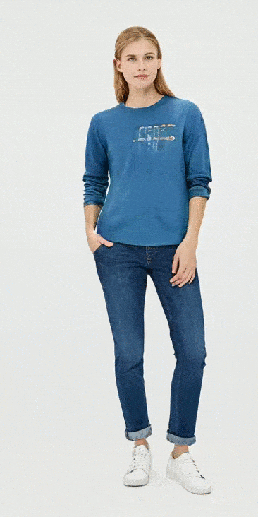

# project_stylegan2

The aim of this work is to obtain realistic and diverse images of good quality.  

To achieve this goal, the StyleGAN2 architecture was used in this work to generate full-body images of people. Additionally, the article "Interpreting the Latent Space of GANs for Semantic Face Editing" was utilized. The data consisted of images of people in full-body on a uniform background, collected from online stores Wildberries and Lamoda. A direction vector of the image in the latent space was found. Using this direction, the image transformation was performed.

* **parser_wildb_with_bbox** - parsing online store Wildberries with clothes.  

* **pars_lamoda** - parsing online store Lamoda with clothes.  

* **make_crop_mask_body_to_reid** - in order to find the direction vector of the image in the latent space, it is necessary to annotate the generated images. For this purpose, the DensePose network was used for body part segmentation. Masks of body parts of people were obtained using it. Only one part - the torso - is taken for image transformation.  

* **embeddings_crops_body** - person re-identification is used to obtain features of the found body masks. Torchreid library was used for this task.  

* **svm_body_latents_find_direction** - using the latent vector of the reference image, it is necessary to transform the image generated by StyleGAN2. To achieve this, features in the latent space with a specific clothing color are separated (the latent vector of the torso of the reference image is taken), and the rest of the features. Support Vector Machine (SVM) was used for feature classification. After the separating hyperplane in the latent space was found with SVM, the direction vector at the reference image was determined, and using it, the clothing color of the generated image was changed.

